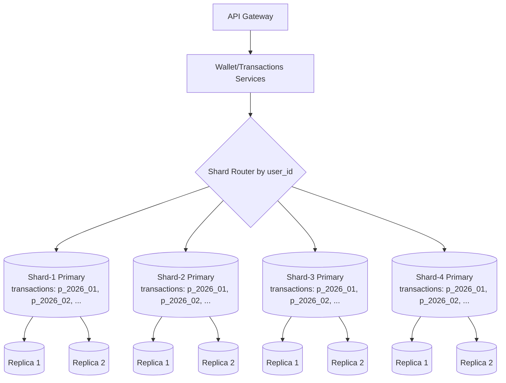
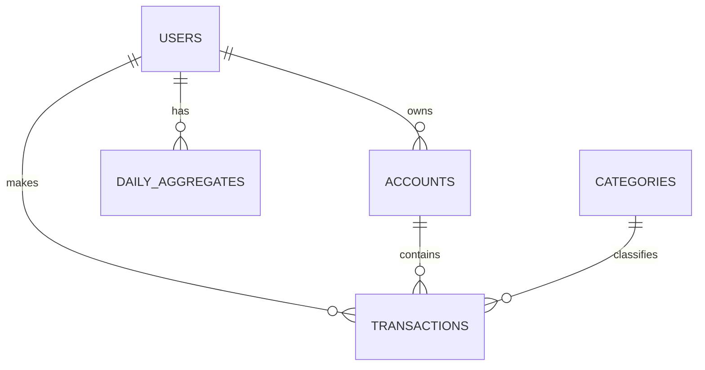

# LAB_4 - Проектирование БД: partitioning, sharding, replication

## Цель

Спроектировать БД для системы учета доходов/расходов и обосновать:
- структуру таблиц;
- стратегию партиционирования;
- стратегию шардирования;
- репликацию и поведение при сбоях.

## Архитектурная диаграмма

## ER-диаграмма

## Ключевые решения

1. Таблица с максимальным ростом: `transactions`.
2. Партиционирование: `RANGE` по времени (`event_time`) помесячно.
3. Шардирование: `hash(user_id) mod N`, старт `N=4`.
4. Репликация: `1 primary + 2 replicas` на каждый шард.

