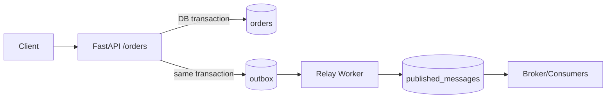

# LAB_7 - Transactional Outbox

## Быстрая навигация

- [Цель](#цель)
- [Архитектура](#архитектура)
- [Что реализовано](#что-реализовано)
- [Запуск](#запуск)
- [Проверка](#проверка)
- [Остановка](#остановка)

## Цель

Реализовать паттерн Transactional Outbox: бизнес-данные и событие записываются атомарно в одной транзакции, а публикация выполняется отдельным relay-процессом.

## Архитектура



## Что реализовано

- `POST /orders`:
  - создает заказ в `orders`;
  - в той же транзакции создает событие в `outbox`.
- Relay worker:
  - читает `outbox` со статусом `sent=false`;
  - переносит событие в `published_messages`;
  - отмечает `sent=true`.
- Idempotency:
  - уникальный `outbox_id` в `published_messages` защищает от дублей.

## Запуск

```powershell
cd C:\Users\Vika\Documents\STRIS\LAB_7
docker compose up --build -d
docker compose ps
```

## Проверка

Health:
```powershell
Invoke-RestMethod http://localhost:8400/health
```

Создать заказ:
```powershell
Invoke-RestMethod -Method Post -Uri http://localhost:8400/orders -ContentType "application/json" -Body '{"user_id":101,"amount":199.99}'
```

Состояние:
```powershell
Invoke-RestMethod http://localhost:8400/debug/state
```

Ожидание:
- заказ есть в `orders`;
- событие есть в `outbox` и затем становится `sent=true`;
- событие появляется в `published_messages`.

## Остановка

```powershell
docker compose down
```

