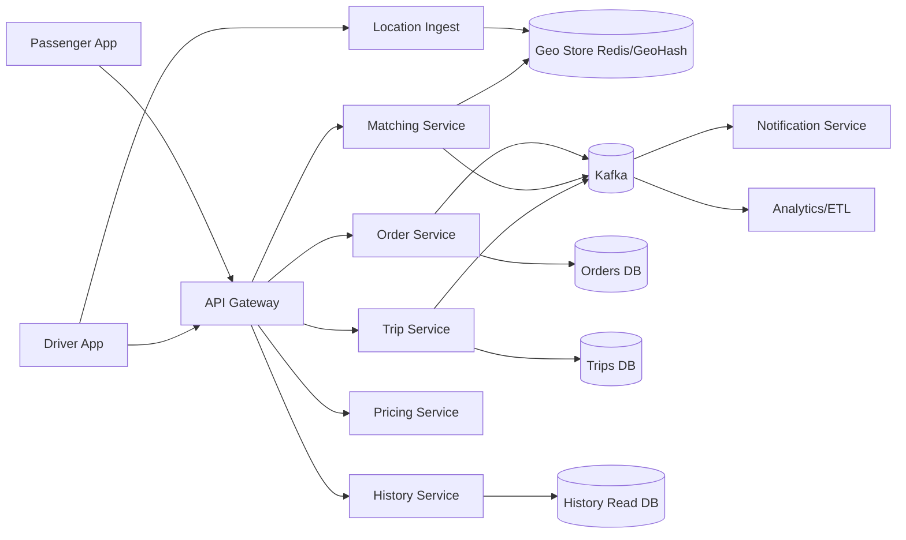
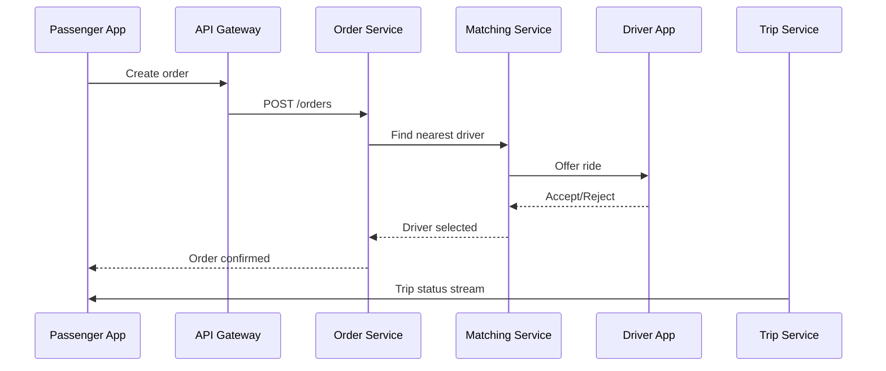

# LAB_8 - Проектирование системы уровня Яндекс Такси

## Быстрая навигация

- [Цель](#цель)
- [Функциональные требования](#функциональные-требования)
- [Логическая архитектура](#логическая-архитектура)
- [Поток заказа](#поток-заказа)
- [Оценка нагрузки](#оценка-нагрузки)
- [Оценка хранения](#оценка-хранения)
- [Отказоустойчивость](#отказоустойчивость)

## Цель

Спроектировать высоконагруженную систему такси: сервисы, потоки данных, оценка нагрузки и хранения, отказоустойчивость.

## Функциональные требования

- Заказ такси.
- Выход/уход водителя с линии.
- Поиск ближайшего водителя.
- Подтверждение/отклонение поездки.
- Трекинг поездки.
- История поездок.

## Логическая архитектура

## Поток заказа

## Оценка нагрузки

- 100 млн пассажиров * 1 поездка/день = 100 млн поездок/день.
- Средний RPS создания заказов: `~1157`.
- Пиковый RPS (x5): `~5800`.
- Геообновления дают значительно больший поток событий (сотни тысяч событий/сек в пике).

## Оценка хранения

- При ~1 KB на поездку: около 100 GB/день по trip-данным.
- Порядка десятков TB в год без учета реплик.
- Геопозиции хранятся в hot-storage короткое время, затем в архив.

## Отказоустойчивость

- Критичные сервисы в multi-AZ.
- Репликация БД и автопереключение.
- Kafka как буфер пиков и decoupling между сервисами.

